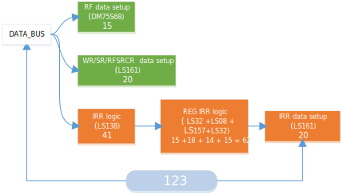

# hm-51 Documention <!-- omit in toc -->
---
## Table of Cotents  <!-- omit in toc -->
- [Introduction](#introduction)
- [The Technical Points](#the-technical-points)
  - [Clock Generator](#clock-generator)
  - [Timming Constraint](#timming-constraint)
  - [Hold Time](#hold-time)
  - [Drive Capability](#drive-capability)
    - [decoder](#decoder)
    - [data bus](#data-bus)
- [Hardware Resources](#hardware-resources)
  - [Interrupt](#interrupt)
  - [SFR map](#sfr-map)
  - [TCON](#tcon)
  - [TL0, TH0, TL1, TH1](#tl0-th0-tl1-th1)
  - [SCON](#scon)
  - [SBUF](#sbuf)
- [Modules' pictures](#modules-pictures)
  - [Clock Generator](#clock-generator-1)
  - [MIPC and Decoder](#mipc-and-decoder)
  - [RF](#rf)
  - [ALU ,WR and BR](#alu-wr-and-br)
  - [SR, RAM, ROM and XRAM](#sr-ram-rom-and-xram)
  - [MISC](#misc)
  - [SCON,TCON](#scontcon)
  - [Serial Receiver(SBUF)](#serial-receiversbuf)
  - [Serial Transmitter(SBUF)](#serial-transmittersbuf)
  - [Timmer(TL0, TL1, TH0, TH1)](#timmertl0-tl1-th0-th1)
  
## Introduction
  As I mentioned before, the hardware design is up to you. You can put all the components on a large PCB, or divide the design into small modules and then connect them together. So that I'll only disscuss tow major technical points in detail.
  If you are not interasted build one by youself and just want to what it's looks like, go to the section [Modules' pictures](#modules-pictures).
 
 Since it's my first time to design hardware, I chose the latter option for more convenience troubleshooting.

## The Technical Points
### Clock Generator
  If there are synchronous RAM, we don't need the clock generator, But the chip I'm using now(IDT6116SA32TP) is asynchronous, and the `RAM_WE` singal is generated by EEPROM, which has long propagation delay. So the SRAM chip will have a great probability of writing unexpected data:

  

  The simple solution is to freeze the data bus for one more cycle, which means writing to RAM/XRAM will take 2 cycles:

  
  
  Since the duration of `WE` pulse is pretty short compare to one clock cycle, what I had done is to steal some time before rising edge of CLK to generate a tiny pulse of `CLKA`, then using `CLKA`, `RAM_WE` and NAND gate to generate `/RAM_WE_PULSE`.

  

  Actually, I'm not steal but use a higher frequency clock(mark as `XCLK`) and clock divider to generate the main clock(labeled `CLK`), then select the proper piece of `XCLK` as `CLKA`.

  For example, I'm using a 12MHz `XCLK` and divide it into 1MHz `CLK`, that's how `CLKA` configured:

  

  The duration of high level of `CLKA` is constant 1 `XCLK` period, the high/low level percentage of `CLKA` is arbitary, as long as it meets the requirements of the chip.

By the way, the NAND gate will add some delay to `/RAM_WE_PULSE`, although there is contamination delay in register/ALU, I'd recommend you to balance the delay on `CLK`(usually add a buffer).

### Timming Constraint
**notice:** The delay time from datasheets may come from different test conditions, and the realatic conditions are also differ to datasheets, but it still give us a theorical reference numeral, there won't be giant different between pratical and paper.

Exploring timing constraints will provide us with information about the highest CPU frequency, because we have the `CLKA` signal from SRAM chip, I divided the timming into two portion: 
  - `Tp` : minimum popagation delay from device output to data bus
  - `Ts` : minimum setup time of device read data from data bus

And will also get other timming:
  - `Tclk` :   time of one `CLK` cycle
  - `Thclka` : time of high logic level of `CLKA`
  - `Trs` : maximum RAM chip setup up time
  - `Trwe`: minimum time of RAM chip WE pulse
  
Then we will have these constraints formula in normal case:
  - `Tp + Ts < Tclk`
  - `Tp + Trs  < Tclk - Thclka`
  - `Trwe < Thclka`
  
Using the `XCLK` is better for caculation, if the `XCLK`'s period time is `Txclk` and you will divide it by `n`, then we get:
  - `Tclk = n Txclk`
  - `Thclka = Txclk`

so that:
  - `Tp + Ts < n Txclk`
  - `Tp + Trs < (n - 1) Txclk`
  - `Trwe < Txclk`

For my design, if you have glimpse of the ALU design, you will know that signifcant portion of delay comes from the ALU, the delay of other devicse is almost impossible to exceed it. 
  Therefore, I almost only consider the chip that have connection with ALU in the timming constraint, then we will get `Tp`:

  

  Now we get `Tp = 561` and there is an abnormal case, the data path to BR will be the maximum delay path if there is not SFR connected, let's mark it as `Tbr = 623`.
  
  For setup up time , we have:
  

  So `Ts = 123`, then according the datasheet and clock design, we have: 
  - `Txclk = 1000/12`
  - `Trwe = 20`
  - `Trs = 0`(eqvialent)
  
Now we can verify the timming constraint:
  -  `Tbr < n Txclk` => `623 < 1000`
  -  `Tp + Ts < n Txclk` => `684 < 1000`
  -  `Tp + Trs < (n - 1) Txclk` => `561 < 916.666`
  -  `Trwe < Txclk` => `20 < 83.333`

Now we can verify the timming constraint:
  -  `Tbr < n Txclk` => `623 < 1000`
  -  `Tp + Ts < n Txclk` => `684 < 1000`
  -  `Tp + Trs < (n - 1) Txclk` => `561 < 916.666`
  -  `Trwe < Txclk` => `20 < 83.333`
 
Actually， it's totally fine in theory if you divide the `XCLK` by 9, but I still want a reguler frequency of `CLK` :
  -  `Tbr < n Txclk` => `623 < 750`
  -  `Tp + Ts < n Txclk` => `684 < 750`
  -  `Tp + Trs < (n - 1) Txclk` => `561 < 666.666`
  -  `Trwe < Txclk` => `20 < 83.333`

### Hold Time
  Hold time is not a problem any more in today's, but I still decide to mention it.
  
  The `DM85S68` has 15ns hold time ,which is pretty long compare to The `74LS161`'s 3ns. Thanks for 13ns of `74LS161`'s typical delay, and the tristate buffer for added in 74LS161 output, it met the hold time of DM85S68.

### Drive Capability
  There are too many chips attached to the data bus, which requires the chips to have a strong output on the data bus. We also mix using CMOS chip and 74LS chip, they have totally different drive capabilities, the CMOS series are usually smaller than 74LS series.

  The characteristics of most chips which operated under recommended conditions were given in the following table:

|        chip         | family |  IOH   | IIH | IOL  |          IIL          |
|:-------------------:|:------:|:------:|:---:|:----:|:---------------------:|
|         F00         |   F    |  -1m   | 20u | 20m  |         -600u         |
|        LS138        |   LS   | -400u  | 20u |  8m  | -400u(-200u for data) |
| LS153(data, select) |   LS   | -400u  | 20u |  8m  |         -400u         |
|        LS161        |   LS   | -400u  | 20u |  8m  |         -400u         |
|        LS194        |   LS   | -400u  | 20u |  8m  |         -400u         |
|        LS245        |   LS   |  -15m  | 20u | 24m  |         -200u         |
|        LS541        |   LS   |  -15m  | 20u | 24m  |         -200u         |
|       AT28C64       |  CMOS  | -400u  | 10u | 2.1m |         -10u          |
|      IDT6116SA      |  CMOS  | -4000u | 10u |  8m  |         -10u          |
|       DM85S68       |   ?    | -5200u | 50u | 16m  |         -250u         |

According to the table, if we use the same series of chips, we can estimate the LS series can drive about 20 successors and CMOS can drive at least 40:

```  shell
LS(74LS161):
  abs(IOH/IIH) = 20
  abs(IOL/IIL) = 20

COMS (AT28C64):
  abs(IOH/IIH) = 40
  abs(IOL/IIL) = 210
```
#### decoder
There is another problem before we measure data bus, we are using AT28C64 as decoder, the `SSFR` and `RAM_WE` will drive 3 modules chips : IRAM's control, RF's control and SFR control decoder. We are gonna to calculate these two outputs:

`SSFR`
|  chip  |          74F00           |       74LS253(select)        |                      74LS00                      |
|:------:|:------------------------:|:----------------------------:|:------------------------------------------------:|
| module |           RAM            |              RF              |               SFR control decoder                |
| usage  | generate RAM write pulse | select control singal for RF | generate signal which indicate operation of IRAM |

`RAM_WE`
|  chip  |          74F00           |          74LS253(select)          |       74LS00        |
|:------:|:------------------------:|:---------------------------------:|:-------------------:|
| module |           RAM            |                RF                 | SFR control decoder |
| usage  | generate RAM write pulse | provide SFR control singal for RF |  generate /RAM_WE   |


``` js
IIHsfr =  20u + 20u + 20u = 60u
IILsfr = -600u - 400u - 400u = -1400u
IIHram_we =  60u
IILram_we =  -1400u
```
The AT28C64 can hold it fine.
#### data bus
  The data bus is slightly more complicated, core part is unlikey to change, SFR part will changed with the desgin.  SO I will devide the capability into two part: the Core portion and peripheral portion.

 *inputs in core*
| DM85S68 |  LS161   | IDT6116SA | AT28C64 | LS138  |
|:-------:|:--------:|:---------:|:-------:|:------:|
|   RF    | RFSRCREG |    RAM    |  ALUDH  | IRRCLR |
|         |    WR    |   XRAM    |  ALUDL  |        |
|         |    SR    |           |   ROM   |        |
|         |          |           |  ALUS   |        |

``` js
IcIH = 50+3*20+2*10+4*10+20 = 190u
IcIL = -250-3*400-2*10-4*10-400 = -1910u
```


 *inputs in peripheral*

| LS194 |    LS161     |
|:-----:|:------------:|
| SBUF  | TCON,TL0,TL1 |
|       |   TH0,TH1    |
|       |     SCON     |
``` js
IpIH = 20 + 7*20 = 160u
IpIL = -400 - 7*400 = -3200u
```

 *outputs*
|       LS541        | IDT6116SA | AT28C64 |
|:------------------:|:---------:|:-------:|
|       ALUDH        |    RAM    |  ALUS   |
|       ALUDL        |   XRAM    |   ROM   |
|         RF         |           |         |
| periphrial or SFRs |           |         |

``` js
IOH = max(-15000,-4000,-400) = -400u
IOL = min( 24000, 8000, 2100) = 2100u
```
Then we can calculate remaining drive capablity:
``` js
IIH = IcIH + IpIH = 350u
IIL = IcIL + IpIL = -5110u

IrOH = IOH + IIH = -50u
IrOL = IOL + IIL = -3010u
```

Look at the poor drive capability of low logic level of AT28C64, it need 3010uA more in IOL! add a buffer for they(ALUS and ROM) can fix this problem, like add 74LS541:
``` js
IOH = max(-15000,-4000,-15000)u = -4000u
IOL = min(24000,  8000, 24000)u = 8000u

IrOH = -4000u + 350u = -3650u
IrOL = 8000u + -5110u = 2890u
```
## Hardware Resources
### Interrupt

   The IRRs is ordered by priority as IT0, TF0, IT1, TF1, TI, RI.
   
   **NOTICE:** TI and RI are assigned to seperate interrupt numbers, which will be cleared by hardware.


### SFR map
 All available SFRs are listed in the following table, The internal SFR are marked in bold
 and the SFRs that only implement part of standard function will included in parentheses.
| Address |    0    |   1    |    2    |    3    |   4   | 5     | 6 | 7 |
|:-------:|:-------:|:------:|:-------:|:-------:|:-----:|:------|:-:|:-:|
|   F8    |         |        |         |         |       |       |   |   |
|   F0    |  **B**  |        |         |         |       |       |   |   |
|   E8    |         |        |         |         |       |       |   |   |
|   E0    | **ACC** |        |         |         |       |       |   |   |
|   D8    |         |        |         |         |       |       |   |   |
|   D0    | **PSW** |        |         |         |       |       |   |   |
|   C8    |         |        |         |         |       |       |   |   |
|   C0    |         |        |         |         |       |       |   |   |
|   B8    | **IP**  |        |         |         |       |       |   |   |
|   B0    |         |        |         |         |       |       |   |   |
|   A8    | **IE**  |        |         |         |       |       |   |   |
|   A0    |         |        |         |         |       |       |   |   |
|   98    | (SCON)  |  SBUF  |         |         |       |       |   |   |
|   90    |         |        |         |         |       |       |   |   |
|   88    | (TCON)  |        |  (TL0)  |  (TL1)  | (TH0) | (TH1) |   |   |
|   80    |         | **SP** | **DPL** | **DPH** |       |       |   |   |


### TCON
|      Bit      |  7  |  6  |  5  |  4  |  3  |  2  |  1  |  0  |
|:-------------:|:---:|:---:|:---:|:---:|:---:|:---:|:---:|:---:|
|     Name      | TF1 | TR1 | TF0 | TR0 | IE1 | IT1 | IE0 | IT0 |
| Accessibility | R/W | R/W | R/W | R/W | R/W | R/W | R/W | R/W |

All bits in this TCON are readable and writable and it's function is consistent with the standand.
  - IT0 : The interrupt type of external interrupt 0. When it is 0, the type is level trigger, otherwise, it is falling edge trigger.
  - IE0 : Interrupt 0 flag, set to 1 when  external interrupt 0 occurred, automatically cleared when returning from the corresponding interrupt routine(return by RETI).
  - IT1, IE1 : Same function as interrupt 0, just relevant to interrupt 1.

  - TR0: Timmer0 enable bit, timmer0 only counts when it is 0.
  - TF0: Timmer1 overflow bit, set when Timmer0 is overflows(set).
  - TR1, TF1: Same function as Timmer0, just relevant to timmer1.

### TL0, TH0, TL1, TH1
|      Bit      | 7 - 0 |
|:-------------:|:-----:|
| Accessibility |   W   |

TLn and THn will form a 16-bit timmer named 'timmern', when you write value to TLn and THn, you are actully writing the reaload value for this timmern,
and the timmern will automatically load the value when overflow or timmer is disabled.

``` python
MOV TL0, 0x00
MOV TH0, 0xFF  # count from 0xFF00  to 0xFFFF, 0x100 cycle total.
MOV TCON, 0x20 # eable timmer 0

INT_TIMMER0:
  #do something
  reti
```

### SCON
|      Bit      | 7 | 6 | 5 | 4 | 3 | 2 |  1  |  0  |
|:-------------:|:-:|:-:|:-:|:-:|:-:|:--|:---:|:---:|
|     Name      | X | X | X | X | X | X | TI  | RI  |
| Accessibility | X | X | X | X | X | X | R/W | R/W |

This register is used to indicate SBUF's state. 
  - RI: set when SBUF received a byte.
  - TI: set when byte in SBUF was sent.
  - 
 notice: RI and TI won't be cleared by hardware.


``` python
# interrupt routine example
INT_SERIAL:
  JB  RI, SERIAL_REC:
  JB  TI, SERIAL_SENT:
  #opss! what's wrong here?
SERIAL_REC:
  #do something relate to recived byte
  CLR RI 
  reti

SERIAL_SENT:
  #do something relate to byte sent
  CLR TI
  reti
```

### SBUF
|      Bit      | 7 - 0 |
|:-------------:|:-----:|
| Accessibility |  R/W  |

Writing a byte to SBUF will start the process of sending bytes via UART,
 while reading SBUF will read the most recently received byte.
 
 ## Modules' pictures
 ### Clock Generator
 

 ### MIPC and Decoder
 

  ### RF
 

 ### ALU ,WR and BR
 

 ### SR, RAM, ROM and XRAM
 
 
  ### MISC
 

  ### SCON,TCON
 

 ### Serial Receiver(SBUF)
 

 ### Serial Transmitter(SBUF)
 

  ### Timmer(TL0, TL1, TH0, TH1)
 